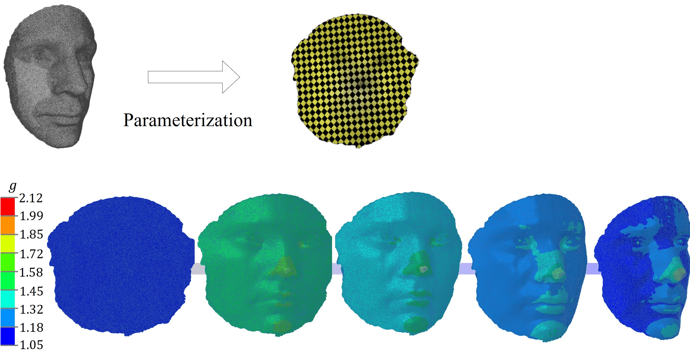
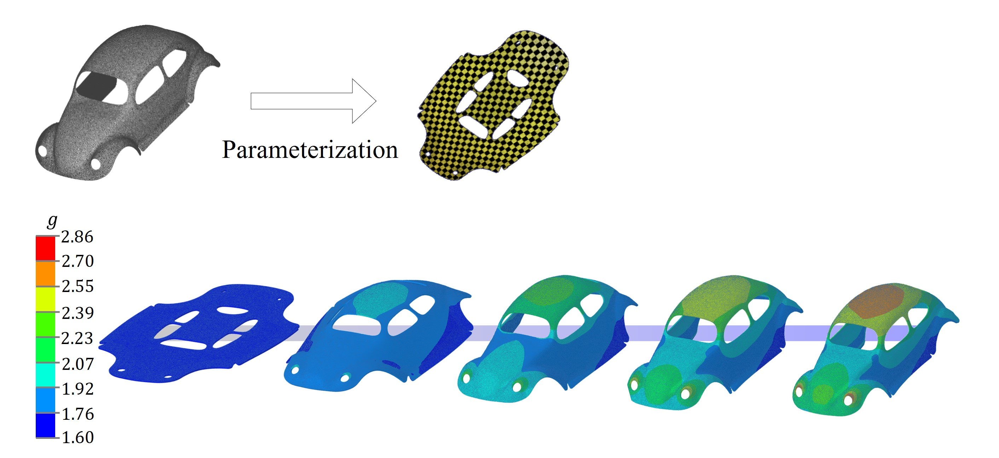
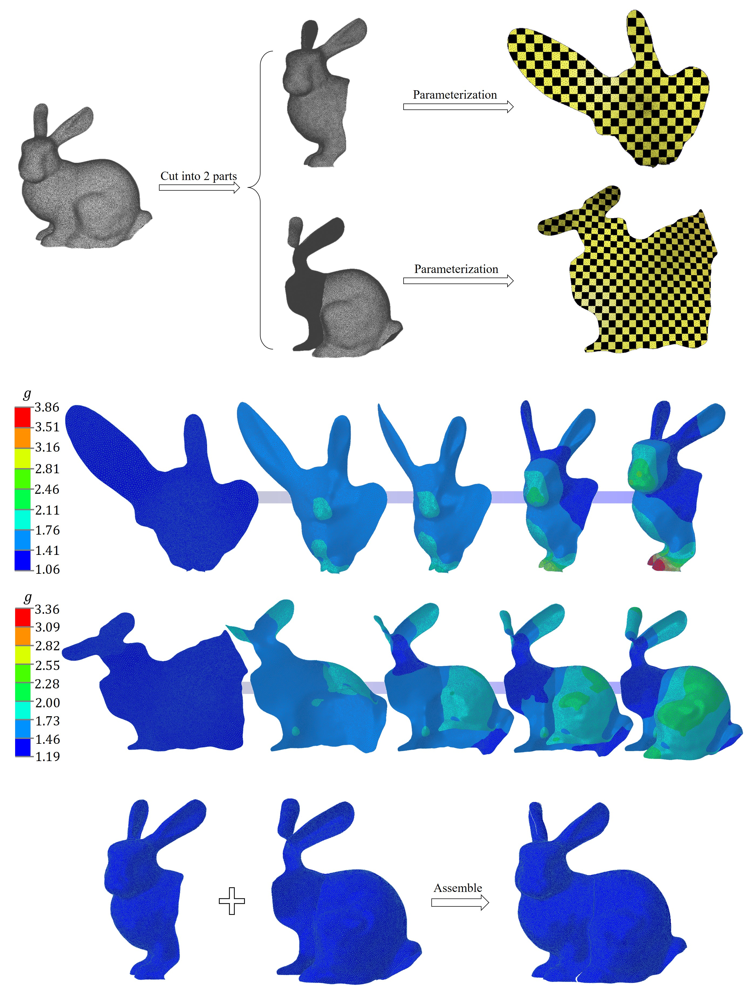

# Realization of planar and surface conformal mappings through growth

_Analytical, geometric, and finite-element resources for realizing planar and surface conformal mappings through stress-free growth of hyperelastic plates._

[](https://github.com/Jeff97/Realization-of-planar-and-surface-conformal-mappings/stargazers)
[](LICENSE)
[](https://doi.org/10.1016/j.jmps.2024.105727)

---

## 📋 Overview

This repository accompanies the paper _Realization of planar and surface conformal mappings through stress-free growth of hyperelastic plates: Analytical formulas and numerical calculations_[^1]. It brings together analytical examples, beam models, complex surface meshes, Abaqus/UMAT simulations, convergence checks, and geometry-processing utilities.


_Figure 1: Representative mapping and simulated growth deformation for a human-face target._

## 📚 Repository map

| Path | Purpose |
| --- | --- |
| [`Analytical_Example/`](Analytical_Example/) | Analytical conformal-mapping examples |
| [`Beam_Example/`](Beam_Example/) | Beam-based examples |
| [`3D_Model_Collection/`](3D_Model_Collection/) | Source geometry collection |
| [`Hunman_face/`](Hunman_face/) | Human-face case files |
| [`Model_car/`](Model_car/) | Model-car case files |
| [`Bunny/`](Bunny/) | Bunny case files |
| [`Instability_Analysis/`](Instability_Analysis/) | Instability calculations |
| [`Mesh_Convergence_test/`](Mesh_Convergence_test/) | Mesh-convergence studies |
| [`libigl_related_codes/`](libigl_related_codes/) | Geometry-processing utilities |
| [`Movie1.mp4`](Movie1.mp4) | 2D, 3D, and complex-surface growth sequences |

The case directories include `.off` geometry, tabulated field data, Abaqus input files, and Fortran user subroutines as applicable. `.off` meshes can be inspected with tools such as MeshLab[^2].

## 📊 Representative results

| Model car | Bunny |
| --- | --- |
|  |  |

_Figures 2–3: Representative complex-surface mappings for a model car and a bunny._

## 🔧 Quick start

### Prerequisites

- Abaqus/Standard with user-subroutine support
- A compatible Fortran compiler linked to Abaqus
- MeshLab or another `.off` viewer for geometry inspection
- Mathematica and a C++ toolchain only for the corresponding analytical or geometry-processing resources

### Run the bunny example

```bat
git clone https://github.com/Jeff97/Realization-of-planar-and-surface-conformal-mappings.git
cd Realization-of-planar-and-surface-conformal-mappings\Bunny\part1
abaqus job=Bunny_Part1 user=Growth-Bunny-Part1.for cpus=6
```

Before submitting a job, open the matching `.for` file and replace author-machine absolute paths used to load files such as `E0.CSV` with paths on your system.

> ⚠️ **Note:** The examples assume experience with Abaqus UMAT development and mesh-based geometry processing. Verify field-data paths, element definitions, boundary conditions, and compiler compatibility before running.

## ✍️ Citation

If this repository supports your research, please cite the article and consider starring the repository.

> J. Wang, Z. Jin, and Z. Li, “Realization of planar and surface conformal mappings through stress-free growth of hyperelastic plates: Analytical formulas and numerical calculations,” _Journal of the Mechanics and Physics of Solids_, vol. 190, 105727, 2024. https://doi.org/10.1016/j.jmps.2024.105727

```bibtex
@article{Wang2024ConformalGrowth,
  title   = {Realization of planar and surface conformal mappings through stress-free growth of hyperelastic plates: Analytical formulas and numerical calculations},
  author  = {Wang, Jiong and Jin, Zili and Li, Zhanfeng},
  journal = {Journal of the Mechanics and Physics of Solids},
  volume  = {190},
  pages   = {105727},
  year    = {2024},
  doi     = {10.1016/j.jmps.2024.105727}
}
```

## 🔐 License

The source code and documentation are available under the [Apache License 2.0](LICENSE). Published figures, referenced papers, meshes, and third-party material remain subject to their respective terms.

[^1]: J. Wang, Z. Jin, and Z. Li. (2024). “Realization of planar and surface conformal mappings through stress-free growth of hyperelastic plates: Analytical formulas and numerical calculations.” _Journal of the Mechanics and Physics of Solids_. https://doi.org/10.1016/j.jmps.2024.105727

[^2]: Cignoni, P. et al. “MeshLab.” https://www.meshlab.net/
